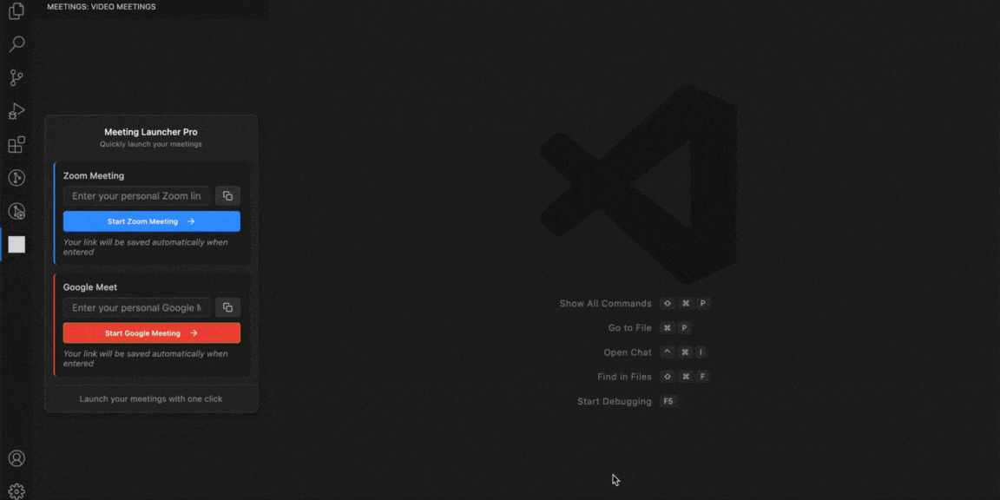

# Zoom / Google & Google Meet for VS Code Extension

This **Zoom / Google & Google Meet** extension for Visual Studio Code allows you to **start new Zoom / Google / Google meetings directly from the editor**. It simplifies the process of creating Zoom / Google meetings by integrating the feature into your VS Code environment, making collaboration easier and more convenient.

### Features
- **Start Zoom / Google meetings directly from VS Code**: No need to open the Zoom / Google app or web browser.
- **Quick access** to Zoom / Google meetings from the **Activity Bar**.
- **Webview for direct interaction**: Start Zoom / Google meetings with a single click from the webview interface.
- **(NEW) Save your personal meeting link**: Enter your Zoom / Google Meet link once, and it will be saved automatically within the extension itself (locally on your system).


### Demo

 [](demo.gif)

## Installation

### Install via Visual Studio Code Marketplace

1. Open **VS Code**.
2. Navigate to the **Extensions View** (`Ctrl+Shift+X` or `Cmd+Shift+X`).
3. Search for **"Zoom Meet"**.
4. Click **Install**.

## Usage

Once installed, you will see a new icon in the **Activity Bar** with the label "Zoom / Google". You can access this to start a Zoom / Google meeting directly from the editor.

- Enter your **personal meeting link** in the input field.
- Your link is saved **automatically** when you:
  - Click the **Start Zoom / Google Meeting** button.
  - Or click **outside** the input field.
- The link is stored locally in your VS Code settings — **we do not collect or send any data** externally.
- Launch meetings instantly with one click from the extension panel.

### Command

The extension registers the following commands:

- `zoom.startMeet` / `googlemeet.startMeet`: Starts a new Zoom / Google meeting by opening the saved meeting link (or default Zoom / Google site if none saved).

- `zoom.startMeet / googlemeet.startMeet`: Starts a new Zoom / Google meeting by opening the Zoom / Google website.

### Keybindings

You can use the following keyboard shortcuts:

- **Windows/Linux**: `Ctrl+Alt+Z` / `Ctrl+Alt+G`
- **macOS**: `Control+Option+Z` / `Control+Option+G`

To modify or add additional keybindings, go to **Keyboard Shortcuts** (`Ctrl+K Ctrl+S`).

---

## Development

To contribute to this project or to modify it for your own needs, follow these steps:

1. Clone the repository:
    ```bash
    git clone https://github.com/subham-available/ZoomMeet.git
    ```

2. Install dependencies:
    ```bash
    npm install
    ```

3. Compile the code:
    ```bash
    npm run compile
    ```

4. Start debugging the extension:
    - Press `F5` to open the **Extension Development Host** and test the extension.

5. After making changes, ensure the extension is properly compiled and reloaded.

---

## Acknowledgements

Thanks to the **Visual Studio Code API** and **Zoom / Google Meet** for making this extension possible!
